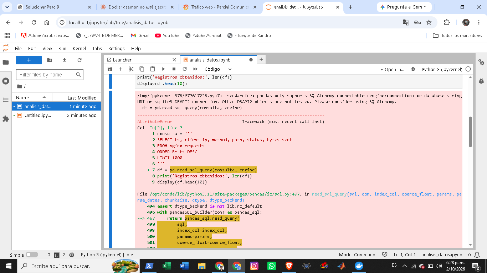
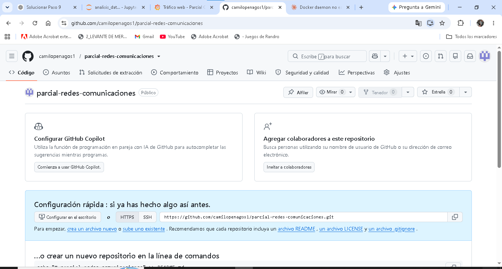
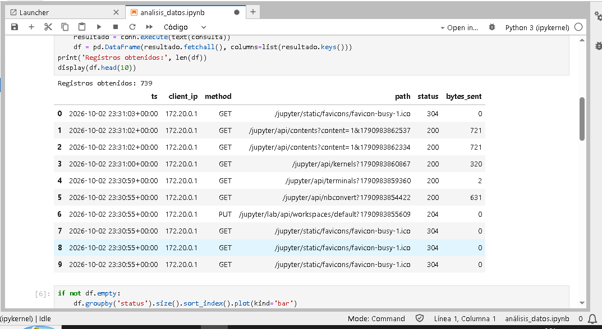
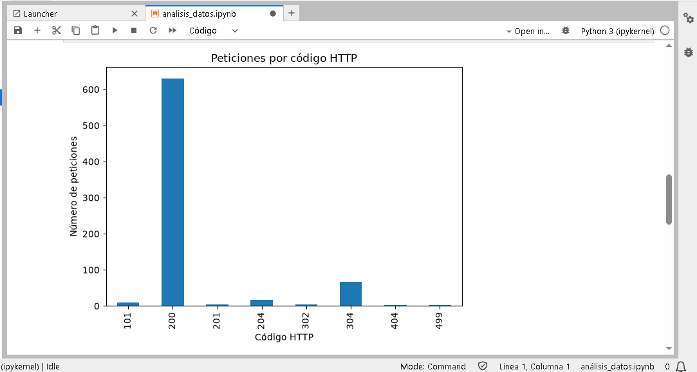
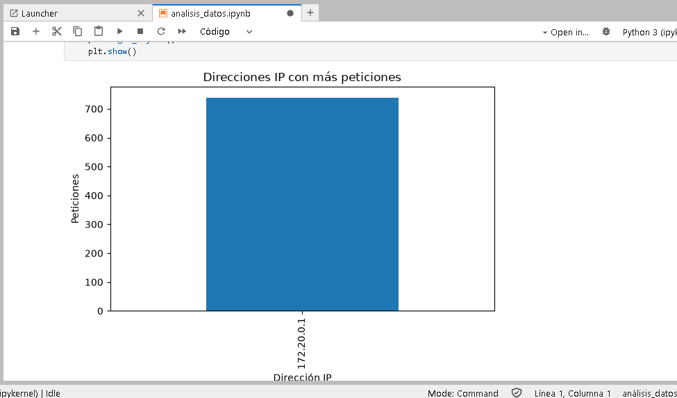
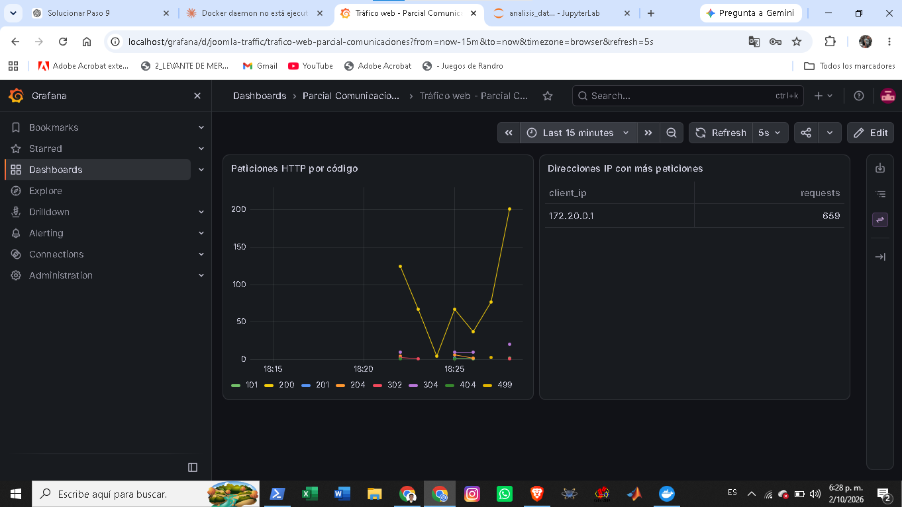

# Informe técnico – Parcial 2 de Comunicaciones

**Estudiante:** Duvan – Ingeniería Mecatrónica
**Repositorio:** https://github.com/camilopenagos1/parcial-redes-comunicaciones
**Fecha de implementación:** 2 de octubre de 2026

---

## 1. Introducción

En este parcial implementé una infraestructura de servicios con contenedores Docker. La idea fue integrar en un solo proyecto un proxy inverso, un portal web, una base de datos, una herramienta de análisis y una de visualización, de forma que todo se levante con un único comando a partir de un repositorio.

| Servicio | Función | Imagen |
|---|---|---|
| Nginx | Proxy inverso y único punto de entrada (puerto 80) | `nginx:alpine` |
| Joomla | Portal web, se instala automáticamente | `joomla:latest` |
| PostgreSQL | Base de datos del portal y de los registros HTTP | `postgres:16-alpine` |
| Jupyter | Análisis de los registros con Python | construida desde `jupyter/base-notebook` |
| Grafana | Dashboards de tráfico HTTP | `grafana/grafana:latest` |

El requisito más importante fue que el profesor pueda **clonar el repositorio en una máquina limpia y ejecutar un único comando**, sin completar asistentes de instalación. Por eso toda la configuración (variables, Nginx, dashboards, fuente de datos, tabla SQL y autoinstalación de Joomla) quedó dentro del repositorio.

---

## 2. Objetivos

**General:** implementar una arquitectura de servicios contenerizados con Docker que integre Nginx, Joomla, PostgreSQL, Jupyter y Grafana, y que permita analizar y visualizar el tráfico HTTP.

**Específicos:**

1. Organizar las configuraciones de cada servicio en carpetas.
2. Levantar los cinco servicios con Docker Compose.
3. Configurar Nginx como proxy inverso con rutas `/`, `/jupyter/` y `/grafana/`.
4. Instalar Joomla de forma automática sobre PostgreSQL.
5. Guardar los registros de Nginx en PostgreSQL.
6. Analizar los datos en Jupyter y visualizarlos en Grafana.
7. Separar el tráfico con dos redes Docker y conservar datos con volúmenes.
8. Documentar los problemas encontrados y su solución.
9. Comprobar el despliegue desde un clon limpio del repositorio.

---

## 3. Estructura del proyecto

```
parcial-redes-comunicaciones
├── .env                     (local, no se sube a GitHub)
├── .env.example
├── .gitignore
├── docker-compose.yml
├── README.md
├── INFORME.md
├── evidencias/              (capturas de este informe)
├── nginx/
│   └── default.conf
├── jupyter/
│   ├── Dockerfile
│   └── notebooks/
│       └── analisis_datos.ipynb
├── grafana/
│   ├── dashboards/
│   │   └── joomla_logs.json
│   └── provisioning/
│       ├── dashboards/dashboard.yml
│       └── datasources/datasource.yml
└── scripts/
    ├── 01-traffic.sql
    └── collect_logs.py
```

El proyecto vive en `C:\Users\duvan\parcial-redes-comunicaciones`. Al principio el repositorio Git se creó por error dentro de `C:\Windows\System32` (carpeta del sistema), por eso lo moví a la carpeta del usuario y comprobé con `git status` que Git seguía funcionando.

---

## 4. Topología y flujo de información

### 4.1. Arquitectura

```
                 NAVEGADOR / HOST
                        │  HTTP :80
                        ▼
                  ┌───────────┐
                  │   NGINX   │  (frontend_net)
                  └─────┬─────┘
        ┌───────────────┼───────────────┐
        ▼               ▼               ▼
   ┌─────────┐    ┌──────────┐    ┌──────────┐
   │ Joomla  │    │ Jupyter  │    │ Grafana  │   frontend_net + backend_net
   └────┬────┘    └────┬─────┘    └────┬─────┘
        └──────────────┼───────────────┘
                       ▼
                ┌─────────────┐
                │ PostgreSQL  │   solo backend_net (internal: true)
                └─────────────┘
```

- **`frontend_net`** (bridge): conecta Nginx con Joomla, Jupyter y Grafana.
- **`backend_net`** (bridge, `internal: true`): conecta esos tres servicios con PostgreSQL. Al ser interna, no tiene salida hacia el exterior.
- Solo Nginx publica un puerto en el equipo (`80:80`). PostgreSQL, Jupyter y Grafana no publican puertos.

### 4.2. Flujo de las peticiones

1. El navegador envía la petición HTTP a `localhost:80`.
2. Nginx la recibe y decide el destino según la ruta: `/` → `joomla:80`, `/jupyter/` → `jupyter:8888`, `/grafana/` → `grafana:3000`.
3. Joomla guarda su contenido en PostgreSQL (`database:5432`) por `backend_net`.

### 4.3. Recolección de registros

```
Nginx → access.log (volumen nginx_logs) → collect_logs.py → PostgreSQL (nginx_requests)
                                                              ├── Jupyter (análisis)
                                                              └── Grafana (dashboard)
```

Nginx escribe `access.log` en el volumen `nginx_logs`, que se monta en el contenedor de Jupyter (solo lectura). El script `collect_logs.py` corre dentro de ese contenedor, lee cada línea nueva con una expresión regular y la inserta en la tabla `nginx_requests`. Así no hizo falta un sexto contenedor.

La tabla guarda: `id`, `ts`, `client_ip`, `method`, `path`, `status` y `bytes_sent`, con índices por fecha y por código de respuesta.

---

## 5. Configuración de los servicios

### 5.1. Variables de entorno

Todas las credenciales están en `.env.example` (plantilla que sí se sube) y se copian a `.env` (que no se sube, está en `.gitignore`):

```powershell
Copy-Item .env.example .env
```

Incluye las variables de PostgreSQL, de conexión y autoinstalación de Joomla (`JOOMLA_SITE_NAME`, `JOOMLA_ADMIN_USER`, `JOOMLA_ADMIN_USERNAME`, `JOOMLA_ADMIN_PASSWORD`, `JOOMLA_ADMIN_EMAIL`), `JUPYTER_TOKEN` y las de Grafana.

### 5.2. Nginx

`nginx/default.conf` define tres `location`. Para Jupyter y Grafana se agregan las cabeceras `Upgrade` y `Connection` para soportar WebSockets, y `X-Forwarded-For` / `X-Forwarded-Proto` para conservar los datos del cliente.

### 5.3. Jupyter

El `Dockerfile` parte de `jupyter/base-notebook` e instala `pandas`, `matplotlib`, `sqlalchemy` y `psycopg[binary]`. El servidor arranca con `--ServerApp.base_url=/jupyter/` para funcionar detrás del proxy, y en segundo plano lanza `collect_logs.py`.

### 5.4. Grafana

Se configura por *provisioning*: `datasource.yml` crea la fuente PostgreSQL (`database:5432`, uid `postgres-ds`), `dashboard.yml` apunta a la carpeta de dashboards y `joomla_logs.json` define dos paneles: peticiones HTTP por código y direcciones IP con más peticiones. Se arranca con `GF_SERVER_SERVE_FROM_SUB_PATH=true` para funcionar en `/grafana/`.

### 5.5. Volúmenes

| Volumen | Uso |
|---|---|
| `postgres_data` | Datos de PostgreSQL |
| `joomla_data` | Archivos del portal |
| `grafana_data` | Datos de Grafana |
| `nginx_logs` | Registros de Nginx compartidos con Jupyter |

---

## 6. Problemas encontrados y soluciones

### 6.1. Repositorio creado en `C:\Windows\System32`
**Problema:** el repositorio quedó en una carpeta protegida del sistema.
**Solución:** lo moví con `Move-Item` a `C:\Users\duvan\parcial-redes-comunicaciones` y verifiqué con `git status`.

### 6.2. Dockerfile guardado como `Dockerfile.txt`
**Problema:** el Bloc de notas agregó `.txt`, entonces `Get-Content .\jupyter\Dockerfile` decía que el archivo no existía.
**Solución:** `Rename-Item ".\jupyter\Dockerfile.txt" "Dockerfile"` y revisé con `Get-ChildItem`. Desde entonces compruebo siempre la extensión real de los archivos en Windows.

### 6.3. Docker Desktop no estaba corriendo
**Problema:** `docker compose up -d --build` mostraba `failed to connect to the docker API at npipe:////./pipe/dockerDesktopLinuxEngine`.
**Causa:** Docker Desktop estaba instalado pero su motor no estaba iniciado.
**Solución:** abrí Docker Desktop, esperé a que indicara *Engine running* y confirmé con `docker version` que aparecían Client y Server.

### 6.4. Comando de Jupyter partido en varias líneas
**Problema:** en `docker-compose.yml`, las opciones `--ServerApp...` estaban en líneas separadas y bash las ejecutaba como comandos distintos.
**Solución:** dejé el comando completo en una sola línea:
```
exec start-notebook.py --ServerApp.base_url=/jupyter/ --ServerApp.token="$${JUPYTER_TOKEN}"
```

### 6.5. `access.log` de Nginx era un enlace simbólico
**Problema:** la imagen oficial de Nginx enlaza `access.log` a `/dev/stdout`, por lo que el recolector no veía ninguna línea.
**Solución:** el contenedor de Nginx borra los enlaces al arrancar y deja que Nginx cree archivos reales:
```
rm -f /var/log/nginx/access.log /var/log/nginx/error.log && exec nginx -g 'daemon off;'
```

### 6.6. Joomla no se instalaba solo
**Problema:** con solo las variables de base de datos, Joomla mostraría el asistente de instalación, y el parcial exige que funcione sin pasos manuales.
**Solución:** agregué las variables de autoinstalación (sitio, administrador, contraseña y correo). El log de Joomla confirmó la instalación automática: creó la base de datos en PostgreSQL, la pobló, escribió `configuration.php` y terminó con `Joomla has been installed`. El aviso `AH00558` de Apache es solo informativo.

### 6.7. El recolector no guardaba registros (conteo en 0)
**Problema:** `SELECT COUNT(*) FROM nginx_requests` devolvía 0 aunque Nginx recibía peticiones.
**Causa:** el script abría `access.log` mientras todavía era el enlace a `/dev/stdout` y seguía leyéndolo después de que Nginx lo reemplazara por un archivo real.
**Solución:** reescribí `collect_logs.py` para esperar un archivo real (no un enlace), abrirlo y reabrirlo si cambia su inodo. Verifiqué que el proceso corría con `ps aux | grep collect_logs` y que el log mostraba `Recolector: conectado a PostgreSQL` y `Recolector: leyendo /var/log/nginx/access.log`. Después del cambio, la consulta por código devolvió registros 200 y 404.

### 6.8. Error 404 al abrir Jupyter y Grafana por el proxy
**Problema:** `http://localhost/jupyter/` mostraba "404: No encontrado".
**Causa:** `proxy_pass http://jupyter:8888/;` terminaba en `/`, así que Nginx quitaba el prefijo `/jupyter/`, pero Jupyter espera recibirlo por su `base_url`. Con Grafana pasa lo mismo por `serve_from_sub_path`.
**Solución:** quité la `/` final: `proxy_pass http://jupyter:8888;` y `proxy_pass http://grafana:3000;`, y reinicié Nginx.

### 6.9. Error de pandas en el cuaderno de Jupyter
**Problema:** al ejecutar `pd.read_sql_query(consulta, engine)` apareció un `AttributeError` y el aviso *pandas only supports SQLAlchemy connectable*.



**Causa:** incompatibilidad entre las versiones de pandas y SQLAlchemy instaladas en la imagen. La conexión a PostgreSQL estaba bien.
**Solución:** ejecuté la consulta directamente con SQLAlchemy y construí el DataFrame a mano:
```python
with engine.connect() as conn:
    resultado = conn.execute(text(consulta))
    df = pd.DataFrame(resultado.fetchall(), columns=list(resultado.keys()))
```
Como la carpeta `notebooks` está montada como volumen, no fue necesario reconstruir la imagen.

### 6.10. Credenciales que no cambiaban
**Problema:** al cambiar usuario y contraseña en `.env`, el acceso seguía igual.
**Causa:** Joomla y Grafana guardan las credenciales la primera vez que arrancan, dentro de sus volúmenes.
**Solución:** actualicé `.env.example`, copié a `.env` y recreé todo con `docker compose down -v` y `docker compose up -d --build`.

### 6.11. Archivos que no debían subirse a GitHub
**Problema:** `git status` mostraba `.env` y `.ipynb_checkpoints` listos para el commit, porque el `.gitignore` no existía.
**Solución:** creé el `.gitignore` desde PowerShell, quité esos archivos con `git rm --cached` y verifiqué que no aparecieran antes del commit. Como no había commits previos, `.env` nunca entró al historial.

### 6.12. Errores de Git al subir el proyecto
- **Identidad no configurada:** `unable to auto-detect email address`. Configuré `user.name` y `user.email` con `git config --global`.
- **Remoto con valor de ejemplo:** `origin` apuntaba a una URL con `TU_USUARIO`. Lo corregí con `git remote set-url`.
- **`Repository not found`:** mi usuario de GitHub era `camilopenagos1`, no el que había usado en la URL. Cambié el remoto y la autenticación se hizo desde el navegador.



---

## 7. Verificación de funcionamiento

### 7.1. Estado de los contenedores

Los cinco servicios quedaron arriba: `parcial_database` (healthy), `parcial_jupyter` (healthy), `parcial_joomla`, `parcial_grafana` y `parcial_nginx`, que es el único con puerto publicado (`0.0.0.0:80->80/tcp`).

<!-- Agregar la captura de `docker compose ps` y quitar estos comentarios:

-->

### 7.2. Joomla

`http://localhost/` muestra el sitio ya instalado, sin asistente. El panel de administración está en `http://localhost/administrator`.

<!--  -->

### 7.3. Jupyter

En `http://localhost/jupyter/` (con el token) abrí `analisis_datos.ipynb` y ejecuté todas las celdas. El cuaderno obtuvo **739 registros** desde PostgreSQL y mostró las peticiones reales, incluidas las propias de Jupyter (`/jupyter/api/...`).







**Interpretación de los códigos:**

- **200:** respuesta normal. Es la gran mayoría.
- **304:** el navegador reutilizó archivos de su caché.
- **101:** cambio de protocolo a WebSocket que usa Jupyter; demuestra que Nginx reenvía correctamente `Upgrade` y `Connection`.
- **204 y 201:** respuestas sin contenido y recursos creados por la API de Jupyter.
- **302:** redirecciones, por ejemplo de `/jupyter` a `/jupyter/`.
- **404:** rutas inexistentes que generé a propósito (`/no-existe`).
- **499:** conexiones que el cliente cerró antes de recibir respuesta, típicas de WebSockets y recargas.

### 7.4. Grafana

En `http://localhost/grafana/` el dashboard **Tráfico web - Parcial Comunicaciones** apareció solo, sin crearlo a mano, dentro de la carpeta *Parcial Comunicaciones*. Muestra la serie de peticiones por código y la tabla de IPs (659 peticiones desde `172.20.0.1` en el rango consultado).



**Sobre la IP `172.20.0.1`:** es la puerta de enlace de la red `frontend_net`. Docker Desktop enruta el tráfico del navegador a través de ella, así que Nginx registra esa IP y no la del computador. Esto se relaciona con la capa 3 del modelo OSI.

### 7.5. Persistencia y redes

<!--
Agregar las capturas de estos comandos y quitar estos comentarios:
docker compose down / up -d  y  SELECT COUNT(*) FROM nginx_requests;  (antes y después)
docker volume ls
docker network inspect parcial-redes-comunicaciones_backend_net   ("Internal": true)
docker compose port nginx 80


-->

Al ejecutar `docker compose down` sin `-v` y volver a levantar, el número de registros se conserva porque los volúmenes no se eliminan. `docker network inspect` permite comprobar que `backend_net` es interna y que `database` solo está en esa red.

---

## 8. Análisis desde el modelo OSI

### 8.1. Capa 7 – Aplicación
Se usa HTTP entre el navegador, Nginx y las aplicaciones web. Nginx agrega o conserva las cabeceras `Host`, `X-Real-IP`, `X-Forwarded-For` y `X-Forwarded-Proto` para que Joomla, Jupyter y Grafana conozcan los datos del cliente original, y `Upgrade`/`Connection` para los WebSockets de Jupyter y Grafana. Los servicios también se comunican con PostgreSQL mediante su protocolo propio. El formato del `access.log` (IP, fecha, método, ruta, código y bytes) es lo que analiza el recolector.

### 8.2. Capa 4 – Transporte
Todo va sobre TCP. Puertos usados: **80** (Nginx, el único publicado), **5432** (PostgreSQL), **8888** (Jupyter) y **3000** (Grafana). Los tres últimos solo se alcanzan dentro de las redes Docker. Los códigos 101 y 499 del registro se relacionan con conexiones persistentes y con conexiones cerradas por el cliente.

### 8.3. Capa 3 – Red
Docker crea dos redes bridge, `frontend_net` y `backend_net`. En `backend_net` (`internal: true`) no hay salida hacia el exterior, lo que aísla a PostgreSQL. Docker también ofrece un DNS interno, por eso los servicios se alcanzan por nombre (`database`, `joomla`, `jupyter`, `grafana`) y no por IP. La IP `172.20.0.1` que aparece en los registros es la puerta de enlace de la red. El acceso desde el host usa reenvío de puertos con NAT (`80:80`).

### 8.4. Capa 2 – Enlace de datos
Cada red bridge se implementa como un puente virtual (`br-*`) en el que se conectan las interfaces virtuales `veth*` de los contenedores. La resolución de direcciones IP a MAC dentro de cada red se hace con ARP. Se puede observar con `docker compose exec nginx ip addr` y `docker compose exec nginx ip neigh`.

<!--  -->

---

## 9. Cumplimiento del requisito de despliegue

Para usar el proyecto desde una máquina limpia:

```powershell
git clone https://github.com/camilopenagos1/parcial-redes-comunicaciones.git
cd parcial-redes-comunicaciones
Copy-Item .env.example .env
docker compose up -d
```

Requisitos: Git, Docker Desktop abierto y el puerto 80 libre. Docker descarga las imágenes, construye Jupyter, instala Joomla, crea la tabla `nginx_requests`, carga la fuente de datos y el dashboard de Grafana, y arranca el recolector, todo sin intervención manual. Como la tabla empieza vacía, hay que generar tráfico para ver datos:

```powershell
1..30 | ForEach-Object { curl.exe -s -o NUL http://localhost/ }
```

| Servicio | Dirección | Acceso |
|---|---|---|
| Joomla | http://localhost/ | Público |
| Joomla (admin) | http://localhost/administrator | Variables `JOOMLA_ADMIN_*` del `.env.example` |
| Jupyter | http://localhost/jupyter/ | Token `JUPYTER_TOKEN` |
| Grafana | http://localhost/grafana/ | Variables `GRAFANA_ADMIN_*` del `.env.example` |

<!-- Después de hacer la prueba de clonado limpio, agregar aquí la captura y el resultado:

-->

---

## 10. Conclusiones

- Docker Compose permitió describir los cinco servicios, las redes y los volúmenes en un solo archivo y levantar todo con un comando.
- Nginx como proxy inverso dejó un único punto de acceso, con PostgreSQL aislado en una red interna y sin puertos publicados.
- Los problemas que más tiempo tomaron no estuvieron en los servicios sino en los detalles: el enlace simbólico de `access.log`, la `/` final de `proxy_pass`, la autoinstalación de Joomla y las credenciales guardadas en los volúmenes. Resolverlos obligó a revisar logs, procesos y archivos dentro de los contenedores.
- Jupyter y Grafana consultan los mismos datos desde dos enfoques: análisis con Python y dashboards en tiempo casi real.
- Trabajar en Windows exigió cuidar detalles como las extensiones `.txt` ocultas, la ubicación de las carpetas y los archivos que no deben subirse a GitHub (`.env`, `.ipynb_checkpoints`).
- El proyecto quedó listo para que otra persona lo clone y lo ejecute sin configurar nada a mano.
